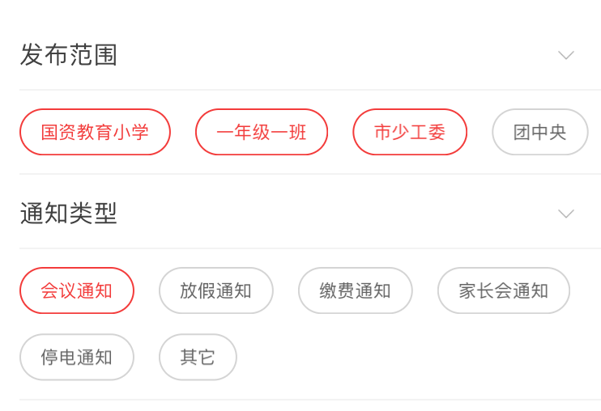

# 一个支持多选的下拉式选项列表

效果如下：



点击右边的下拉按钮，可以收起/展开选项列表。选项列表支持多选（发布范围）和单选（通知类型）。

## 用法

### 导入

SelectOptionDropList 使用 Masonry 来进行布局管理，因此请在 Podfile 中加上此句：

	pod "Masonry"

然后打开示例项目。注意我们使用了 Cocoapods 来管理依赖，因此请打开 SelectOptionDropList.xcworkspace 而不是 SelectOptionDropList.xcodeproj。在项目导航器中，将 Source 文件组下的所有文件拖到你的工程中，并在源文件中 #import "SelectOptionDropList.h"。

### 使用 SelectOptionDropList

在故事板中，拖一个 UIView 到 View Controller 中，设置 Class 为 SelectOptionDropList，并添加适当的约束。注意，height 约束是必须存在的，否则布局可能不正确。

用助手编辑器，将这个 SelectOptionDropList 连接到 IBOutlet，并进行适当命名，比如 selectList。

在 View Controller 的 viewDidLoad 方法中，设置 selectList：

```swift

selectList.title = @"发布范围";
selectList.options = @[@"国资教育小学",@"一年级一班",@"市少工委",@"团中央"];
```

这里设置了 selectList 的 title 和 opptions 属性。前者是列表的标题，后者是用于填充选项列表的字符串数组。

如果只允许单选，可以设置 multiSelectEnable 属性：

```swift
selectList2.multiSelectEnable = NO;// 禁止多选，默认 YES
```

当用户选择完成后，可以这样获取用户选择：

```swift
NSLog(@"%@",selectList.selectedIndex);
NSLog(@"%@",selectList.selectedText);
```

selectedIndex 属性保存了用户选择的选项对应于 options 数组中的索引，selectedText 则对应用户选择的所有位于 options 中的字符串。


